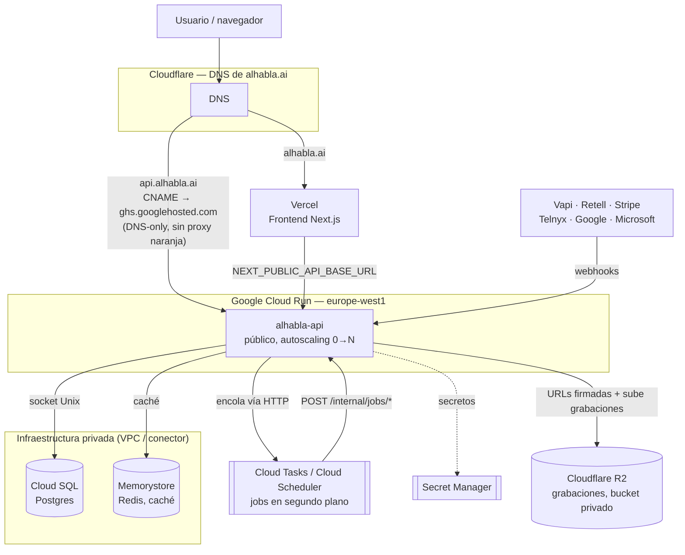

# Alhabla

Alhabla es una plataforma SaaS multi-tenant que proporciona recepcionistas de voz con IA para pequeños negocios en España (peluquerías, barberías, clínicas de fisioterapia, centros de estética, etc.). Cada negocio dispone de uno o más agentes de voz construidos sobre Vapi o Retell.ai. Las cuentas europeas usan Retell por defecto para cumplir RGPD.

## Características principales

- **Agentes de voz multilingües** (español por defecto) con detección automática del orquestador (Vapi/Retell) según el país.
- **Personalización por tipo de negocio**: el prompt del agente incluye instrucciones propias de cada nicho y un catálogo en vivo de servicios/empleados del negocio, para que nunca invente datos ni IDs.
- **Reservas en calendario** (Google Calendar y Outlook) mediante herramientas de voz, con reintento automático en segundo plano si el calendario falla durante la llamada.
- **Detección de tipo de negocio** desde Google Places API para personalizar agentes y servicios.
- **Flujo de registro guiado** con Google Places, selección de servicios, equipo y conexión de calendario.
- **Facturación con Stripe** y provisioning automático de números Telnyx tras la suscripción.
- **Webhooks seguros** con validación HMAC-SHA256 (Vapi) y firma Retell (incluyendo endpoints de herramientas).

## Stack tecnológico

| Capa | Tecnología |
|------|------------|
| Backend | Node.js 20, TypeScript 5.9, Fastify 5 |
| Frontend | Next.js 14, React 18, Tailwind CSS |
| Base de datos | PostgreSQL 15 + Prisma |
| Caché | Redis 7 |
| Colas | Cloud Tasks / Cloud Scheduler (jobs HTTP internos, sin BullMQ) |
| Voice AI | Vapi + Retell.ai |
| Almacenamiento | Cloudflare R2 (S3) |
| Telefonía | Telnyx (Twilio inactivo) |
| Pagos | Stripe |

## Requisitos

- Node.js 20+
- Docker y Docker Compose
- Cuentas y claves de API: Vapi, Retell, Google Cloud (Calendar + Places), Microsoft Azure (Outlook), Stripe, Twilio, Anthropic, Cloudflare R2

## Puesta en marcha rápida

```bash
# Clonar e instalar dependencias
cd backend && npm install && cd ..
cd frontend && npm install && cd ..

# Copiar variables de entorno
cp .env.example .env
# Editar .env con tus credenciales

# Levantar backend + Postgres + Redis + ngrok (dev)
docker compose --profile dev up -d

# Ejecutar migraciones
docker compose exec backend-dev npx prisma migrate dev

# Frontend en desarrollo (puerto 3001)
cd frontend && npm run dev
```

## Comandos útiles

### Backend

```bash
cd backend
npm run dev          # tsx watch
npm run build        # tsc
npm start            # node dist/server.js
npm run test         # vitest run
npm run lint         # eslint
npm run typecheck    # tsc --noEmit
npm run prisma:generate
npm run prisma:migrate
npm run prisma:studio
```

### Frontend

```bash
cd frontend
npm run dev          # Next.js en :3001
npm run build
npm run lint
```

### Docker

```bash
# Desarrollo completo (backend tsx watch, ngrok, postgres, redis)
docker compose --profile dev up

# Producción local (backend compilado, para probar el runtime sin desplegar)
docker compose --profile prod up
```

### Producción real

Backend en Google Cloud Run (`https://api.alhabla.ai`, un solo servicio — los jobs en
segundo plano corren vía Cloud Tasks/Cloud Scheduler contra ese mismo servicio, no en un
worker aparte), frontend en Vercel. Ver `AGENTS.md` § Deployment Notes para la arquitectura
completa y los comandos de despliegue.



## Estructura del proyecto

```
/
├── backend/                # Backend ESM TypeScript
│   ├── src/
│   │   ├── server.ts       # Fastify entry point (rutas + endpoints internos de jobs vía Cloud Tasks)
│   │   ├── plugins/        # auth, CORS, rate-limit, multipart
│   │   ├── modules/        # módulos de rutas por dominio
│   │   ├── adapters/       # Vapi, Retell, Twilio (inactivo), Telnyx
│   │   ├── lib/            # utilidades compartidas
│   │   ├── jobs/           # lógica de jobs en segundo plano (sin framework, invocados vía Cloud Tasks/Scheduler)
│   │   └── config/         # constantes
│   ├── prisma/             # schema y migraciones
│   ├── tests/              # suite Vitest
│   ├── scripts/            # scripts E2E
│   └── Dockerfile
├── frontend/               # Next.js 14
├── docker-compose.yml
└── .env                    # compartido por docker compose (no se commitea)
```

## Flujo de registro post-login

1. `/register` — email/contraseña o Google OAuth + país.
2. `/register/business` — Google Places API para autocompletar negocio.
3. `/register/business/niche` — tipo de negocio (detectado o manual).
4. `/register/business/services` — plantilla de servicios.
5. `/register/business/team` — empleados y capacidad.
6. `/register/business/calendar` — conectar Google u Outlook.
7. `/checkout` — Stripe checkout (obligatorio para finalizar).

## Seguridad

- JWT firmado con `JWT_SECRET` (obligatorio).
- Webhooks Vapi con HMAC-SHA256 (`x-vapi-signature`).
- Webhooks Retell con firma validada (`x-retell-signature`), incluyendo herramientas personalizadas.
- Webhooks Stripe con firma verificada.
- Rate limiting global (100 req/min) y elevado en webhooks (300 req/min).
- CORS restringido al origen exacto de `FRONTEND_URL`.

## Documentación adicional

- `AGENTS.md` — referencia detallada para agentes de IA y desarrolladores.
- `frontend/src/lib/niche-landings.ts` — copy SEO por nicho.

## Licencia

MIT
