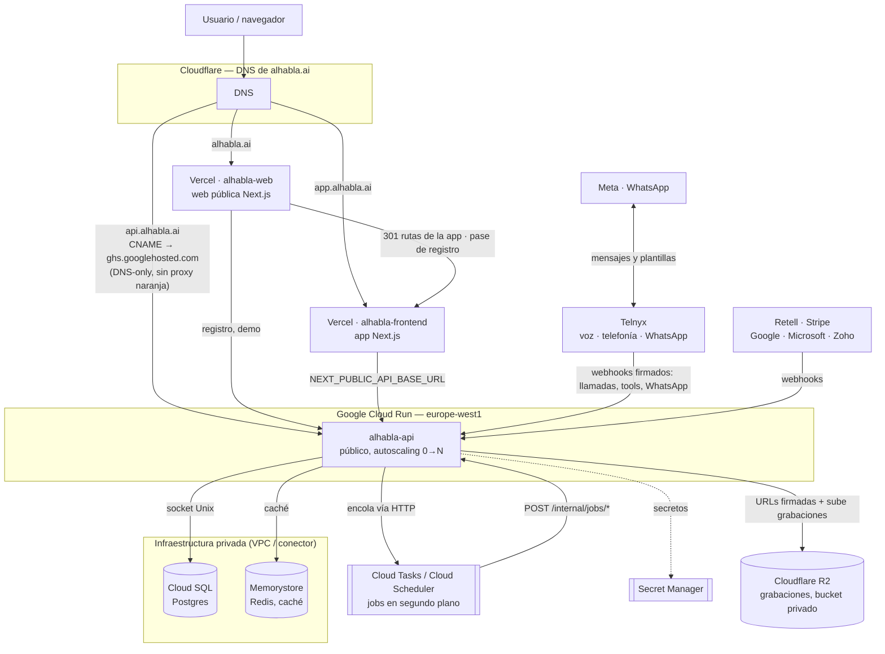

# Alhabla

Alhabla es una plataforma SaaS multi-tenant que proporciona recepcionistas de voz con IA para
pequeños negocios en España (peluquerías, barberías, salones de uñas, centros de estética y
clínicas de fisioterapia). Cada negocio dispone de una recepcionista que atiende sus llamadas,
consulta horario y disponibilidad, reserva en su calendario y, desde septiembre de 2026, habla
también por WhatsApp con el dueño y con sus clientes.

## Características principales

- **Recepcionista de voz** orquestada por **Telnyx AI Assistants** (primario) con **Retell.ai**
  como respaldo (failover automático, hoy inerte). Multilingüe (castellano por defecto; catalán,
  gallego, euskera e inglés si el cliente los usa).
- **Personalización por tipo de negocio**: el prompt incluye instrucciones propias de cada nicho
  y las tools reciben el catálogo en vivo de servicios y profesionales, para que nunca invente
  datos ni IDs. Asignación por especialidad (especialista / lo hace / no sugerir).
- **Reservas en calendario** (Google Calendar, Outlook y Apple/iCloud vía CalDAV) mediante
  tools de voz, con disponibilidad real (capacidad, ausencias, cierres, ocupación del calendario)
  y reintento automático en segundo plano si el calendario falla durante la llamada. Nunca se
  reserva a ciegas.
- **Canal de WhatsApp** (Telnyx como BSP de Meta), un solo contacto con dos números:
  - **Al dueño**: avisos de cada reserva, cita pendiente, cancelación, recado y alerta operativa,
    con botones; y **el Gestor**, un asistente con el que consulta la agenda y las llamadas y al
    que pide cambios (apuntar, mover o cancelar citas, ausencias, cierres, servicios, equipo,
    horario, onboarding completo). Nunca ejecuta nada sin un botón de confirmación. Disponible
    también en el panel (`/gestor`).
  - **Al cliente**: confirmación y recordatorio de la cita con botones, aviso de cambio o
    cancelación, lista de espera («hueco libre» → «Sí, resérvala») y **la misma recepcionista
    por chat** (consulta, reserva y cancela como por teléfono).
- **Detección de tipo de negocio** desde Google Places API para personalizar agentes y servicios.
- **Registro guiado**: cuenta en la web pública, asistente del negocio en la app (Google
  Places, servicios, equipo, calendario) y checkout.
- **Facturación con Stripe** y provisioning automático de números Telnyx tras la suscripción.
- **Webhooks firmados** (Retell, Telnyx —Ed25519—, Stripe) para eventos, tools y mensajes.

## Stack tecnológico

| Capa | Tecnología |
|------|------------|
| Backend | Node.js 20, TypeScript 5.9, Fastify 5 |
| App (`frontend/`, app.alhabla.ai) | Next.js 14, React 18, Tailwind CSS, TanStack Query |
| Web pública (`web/`, alhabla.ai) | Next.js 14, React 18, Tailwind CSS, blog en MDX |
| Base de datos | PostgreSQL 15 + Prisma |
| Caché | Redis 7 |
| Colas | Cloud Tasks / Cloud Scheduler (jobs HTTP internos, sin BullMQ) |
| Voz | Telnyx AI Assistants (primario), Retell.ai (respaldo) |
| WhatsApp | Telnyx (WhatsApp Business Platform de Meta) |
| Almacenamiento | Cloudflare R2 (S3) |
| Telefonía | Telnyx |
| Pagos | Stripe |
| Email | Zoho Mail |

## Requisitos

- Node.js 20+
- Docker y Docker Compose
- Cuentas y claves de API: Telnyx (voz, telefonía y WhatsApp), Retell, Google Cloud
  (Calendar + Places + Login), Microsoft Azure (Outlook), Stripe, Cloudflare R2, Zoho Mail
  (Apple/iCloud no necesita alta de desarrollador: basta una contraseña de aplicación del negocio)

## Puesta en marcha rápida

```bash
# Clonar e instalar dependencias
cd backend && npm install && cd ..
cd frontend && npm install && cd ..
cd web && npm install && cd ..

# Copiar variables de entorno
cp .env.example .env
# Editar .env con tus credenciales

# Levantar backend + Postgres + Redis + túnel de Cloudflare (dev)
docker compose --profile dev up -d

# Ejecutar migraciones
docker compose exec backend-dev npx prisma migrate dev

# La app (puerto 3001) y la web pública (puerto 3002)
cd frontend && npm run dev
cd web && npm run dev
```

## Comandos útiles

### Backend

```bash
cd backend
npm run dev              # tsx watch
npm run build            # tsc
npm start                # node dist/server.js
npm run test             # vitest run (unitarios)
npm run test:integration # contra Postgres/Redis reales (backend/.env.test)
npm run lint             # eslint
npm run typecheck        # tsc --noEmit
npm run prisma:generate
npm run prisma:migrate
npm run prisma:studio
```

### App y web

```bash
cd frontend              # la app (app.alhabla.ai)
npm run dev              # Next.js en :3001
npm run test && npm run lint && npm run build

cd web                   # la web pública (alhabla.ai)
npm run dev              # Next.js en :3002
npm run test && npm run lint && npm run build
```

### Docker

```bash
# Desarrollo completo (backend tsx watch, túnel de Cloudflare, postgres, redis)
docker compose --profile dev up

# Producción local (backend compilado, para probar el runtime sin desplegar)
docker compose --profile prod up
```

### Producción real

Backend en Google Cloud Run (`https://api.alhabla.ai`, un solo servicio — los jobs en
segundo plano corren vía Cloud Tasks/Cloud Scheduler contra ese mismo servicio, no en un
worker aparte). Dos proyectos en Vercel: `alhabla-frontend` (la app, `app.alhabla.ai`) y
`alhabla-web` (la web pública, `alhabla.ai`; `www` y toda ruta de la app redirigen con 301).
DNS en Cloudflare. Ver `AGENTS.md` § Deployment Notes para la arquitectura completa y los
comandos de despliegue, y `PLAN-APP-DOMINIO.md` para el reparto entre las dos webs.



## Estructura del proyecto

```
/
├── backend/                # Backend ESM TypeScript
│   ├── src/
│   │   ├── server.ts       # Fastify entry point: rutas, webhooks y endpoints internos de jobs
│   │   ├── plugins/        # auth, CORS, rate-limit, multipart, internalAuth (OIDC de Cloud Tasks)
│   │   ├── modules/        # rutas por dominio: agents, auth, billing, bookings, businesses,
│   │   │                   #   calendar, calls, demo, gestor, internal, onboarding, phone, places,
│   │   │                   #   recordings, voiceTools, whatsapp
│   │   ├── adapters/       # Retell, Telnyx (voz, WhatsApp), calendarios (Google, Outlook, CalDAV)
│   │   ├── lib/            # prisma, redis, cloudTasks, availability, urls, gestorPayload…
│   │   ├── jobs/           # lógica de los jobs en segundo plano (invocados vía Cloud Tasks/Scheduler)
│   │   └── config/         # constantes
│   ├── prisma/             # schema y migraciones
│   ├── tests/              # Vitest (tests/integration/ contra Postgres/Redis reales)
│   ├── scripts/            # scripts manuales (sincronizar Gestor, plantillas de WhatsApp, tools)
│   └── Dockerfile
├── frontend/               # la app (app.alhabla.ai): panel, agenda, llamadas, agente, Gestor, ajustes
├── web/                    # la web pública (alhabla.ai): landing, sectores, planes, legal, registro, blog
│   └── content/blog/       # artículos en MDX
├── docker-compose.yml
├── AGENTS.md               # referencia técnica completa
├── PLAN-CANAL-DUENO.md     # el canal de WhatsApp (fases 0-2 hechas)
├── PLAN-APP-DOMINIO.md     # el reparto web / app por dominios (hecho)
└── .env                    # compartido por docker compose (no se commitea)
```

## Rutas

### Web pública (`alhabla.ai`)

| Ruta | Qué es |
|---|---|
| `/` | Landing |
| `/peluqueria`, `/barberia`, `/centro-de-estetica`, `/salon-de-unas`, `/fisioterapia` | Landings por sector |
| `/planes` | Planes y calculadora de ROI |
| `/blog`, `/blog/[slug]`, `/blog/rss.xml` | Artículos (MDX en `web/content/blog`) |
| `/legal/aviso-legal`, `/legal/privacidad` | Legales |
| `/register` | Crea la cuenta (email o Google) y salta a la app con un pase de un solo uso |
| `/login`, `/agenda`, `/ajustes/*`, … | 301 a `app.alhabla.ai` (marcadores, emails y botones de WhatsApp antiguos) |

### App (`app.alhabla.ai`)

| Ruta | Qué es |
|---|---|
| `/` | Panel de inicio (sin sesión, a `/login`) |
| `/login`, `/recuperar-contrasena`, `/restablecer-contrasena` | Cuenta |
| `/auth/entrar?pase=…` | Llegada desde el registro de la web: canjea el pase por la sesión |
| `/auth/google/callback` | Vuelta de Google Login |
| `/bienvenida`, `/bienvenida/niche`, `/bienvenida/services`, `/bienvenida/team`, `/bienvenida/calendar` | Asistente del negocio tras el registro |
| `/checkout`, `/checkout/resultado` | Stripe |
| `/agenda` | Citas del día y pendientes |
| `/llamadas`, `/llamadas/analitica` | Llamadas atendidas y analítica |
| `/agente` | Recepcionista: servicios, equipo, horario, calendario, teléfono |
| `/gestor` | Tu Gestor (Beta): el mismo hilo que por WhatsApp, con botones de propuesta |
| `/ajustes`, `/ajustes/facturacion` | Ajustes (incluye WhatsApp del dueño y los interruptores de las conversaciones) |
| `/settings` | Vuelta del OAuth de calendarios |

### API (`api.alhabla.ai`)

| Prefijo | Módulo |
|---|---|
| `/auth/*` | Login, registro (devuelve `pase`), `pase/canjear`, Google Login, contraseña |
| `/business/me`, `/business/me/whatsapp`, `/business/me/gestor` | Negocio, WhatsApp del dueño, el Gestor en el panel |
| `/booking-settings/*` | Servicios, profesionales, capacidad |
| `/calendar/*` | Conexión de calendarios (OAuth y CalDAV) |
| `/billing/*` | Stripe (checkout, portal, `webhook`) |
| `/phone/*` | Números de Telnyx |
| `/agents/*`, `/calls/*`, `/recordings/*` | Recepcionista, llamadas, grabaciones |
| `/demo/*` | Demo pública de voz y Places |
| `/webhooks/retell`, `/webhooks/retell/inbound`, `/webhooks/retell/tools/:agentId/:toolName` | Retell (firmados) |
| `/webhooks/telnyx` | Telnyx: llamadas y **WhatsApp** (mensajes, estados, plantillas), Ed25519 |
| `/webhooks/telnyx/tools/:toolName` | Tools de la recepcionista (voz y chat) |
| `/webhooks/telnyx/gestor/:toolName` | Tools del Gestor (negocio por cabecera desde los metadata) |
| `/internal/jobs/*` | Jobs de Cloud Tasks/Scheduler (OIDC) |

## Flujo de registro

1. `alhabla.ai/register` — email/contraseña o Google + país + aceptación de términos. Crea la
   cuenta y salta a `app.alhabla.ai/auth/entrar?pase=…` (el JWT nunca viaja en la URL).
2. `/bienvenida` — Google Places API para autocompletar el negocio.
3. `/bienvenida/niche` — tipo de negocio (detectado o manual).
4. `/bienvenida/services` — plantilla de servicios.
5. `/bienvenida/team` — empleados y capacidad.
6. `/bienvenida/calendar` — conectar Google u Outlook (Apple se conecta después, desde `/agente`).
7. `/checkout` — Stripe checkout (obligatorio para finalizar).

Lo que el asistente deje a medias lo completa el Gestor por WhatsApp («empezamos»).

## Seguridad

- JWT firmado con `JWT_SECRET` (obligatorio); sesión en `localStorage` de la app.
- Webhooks de Retell (`x-retell-signature`), Telnyx (Ed25519, también los de WhatsApp y las
  tools) y Stripe (`rawBody`) con firma verificada.
- El negocio de cada tool lo fija el backend (cabecera templada desde los metadata de la
  conversación o `businessId` del agente), nunca el modelo.
- El Gestor nunca ejecuta: propone, y solo el botón del dueño ejecuta (propuestas de 24 h,
  reclamo atómico, lock por negocio).
- Rate limiting global (100 req/min), elevado en webhooks y estricto en auth.
- CORS restringido a `APP_URL`, `WEB_URL` y `EXTRA_ALLOWED_ORIGIN`.

## Documentación adicional

- `AGENTS.md` — referencia detallada para agentes de IA y desarrolladores.
- `PLAN-CANAL-DUENO.md` — el canal de WhatsApp: decisiones, fases y estado.
- `PLAN-APP-DOMINIO.md` — el reparto entre la web pública y la app.
- `DESIGN.md` — sistema de diseño.
- `web/src/lib/niche-landings.ts` — copy SEO por nicho.

## Licencia

MIT
